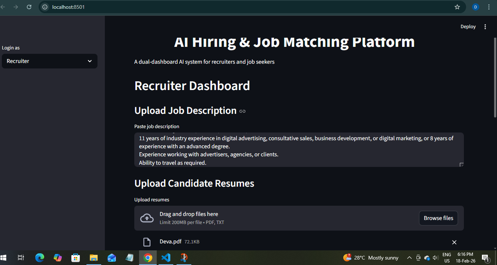
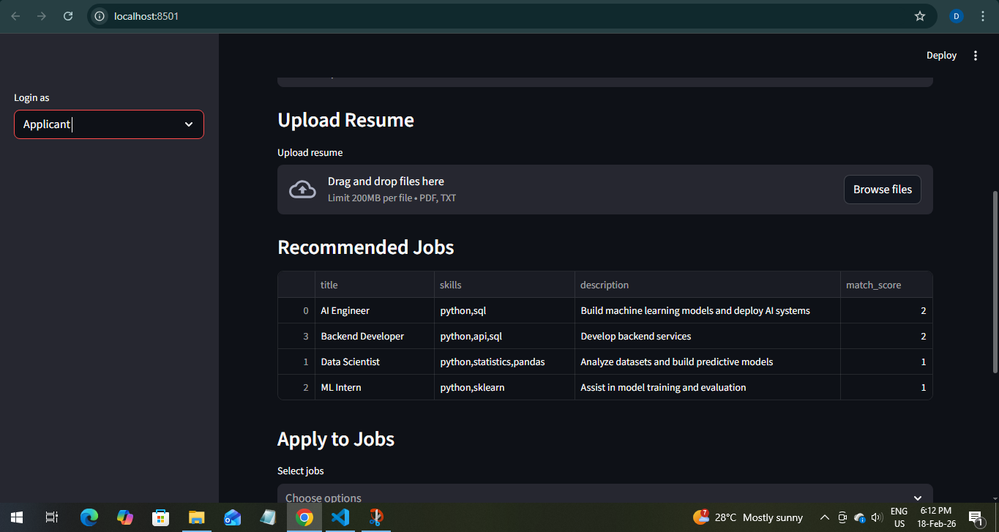
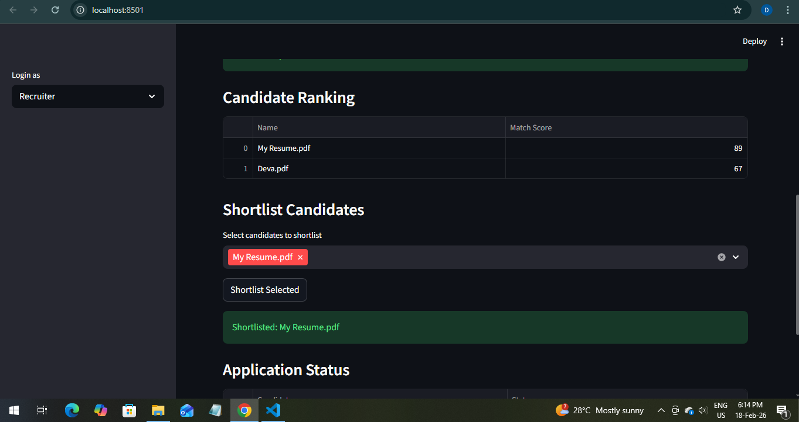

# AI Hiring & Job Matching Platform

AI-powered dual dashboard system for recruiters and job seekers.

## Features
- Skill-based job matching
- Resume upload & tracking
- Candidate ranking simulation
- Recruiter dashboard
- Applicant dashboard
- Application tracking

## Tech Stack
Python, Streamlit, Pandas

## How it works
Applicants enter skills → system recommends jobs → resume tailoring  
Recruiters upload job descriptions → upload resumes → rank candidates → shortlist

## Run locally
pip install streamlit pandas
streamlit run app.py
## Screenshots

### Applicant Dashboard

### Recruiter Dashboard

### Ranking & Tracking

